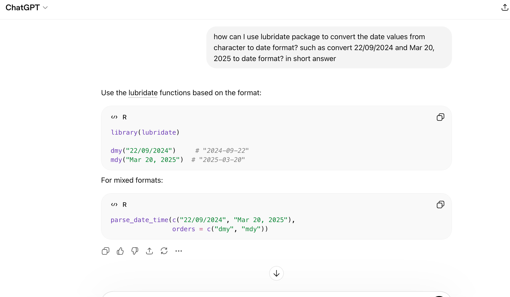
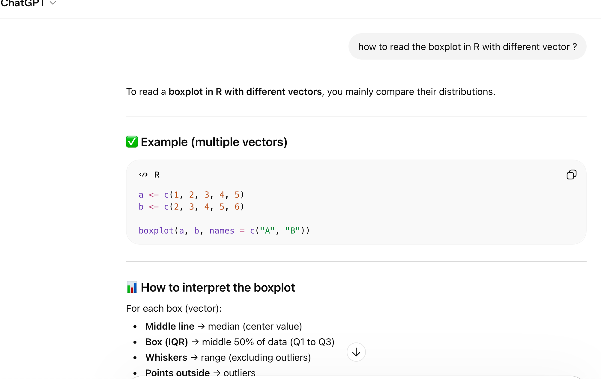
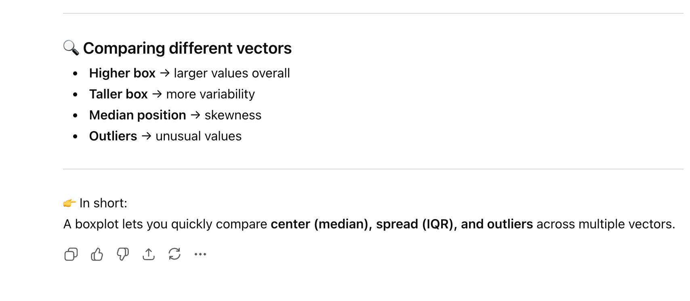
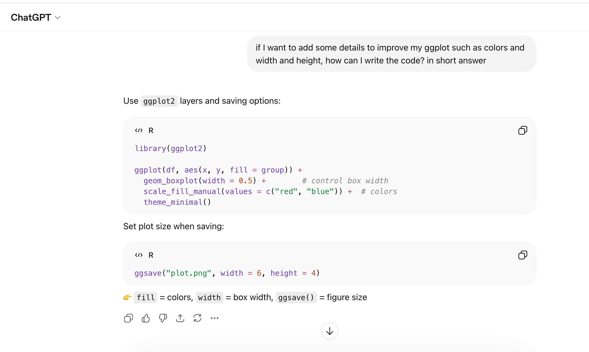
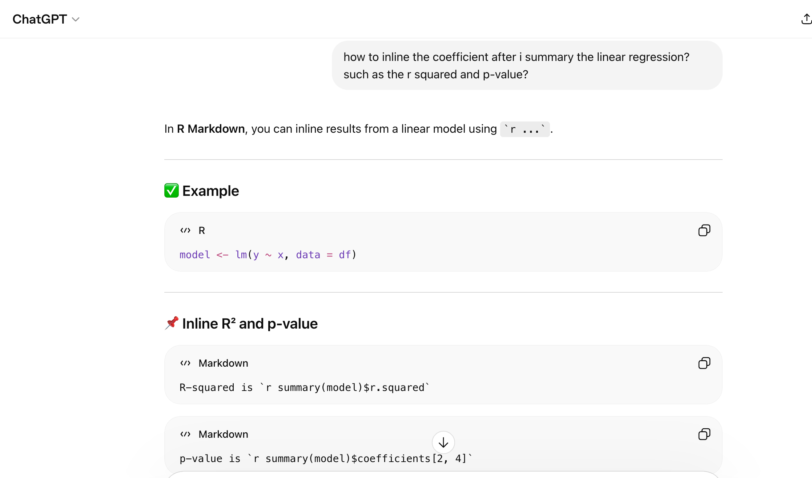
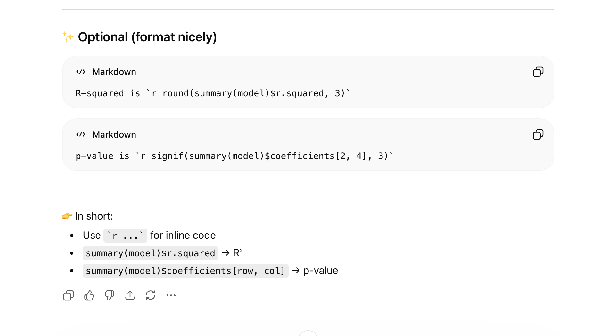
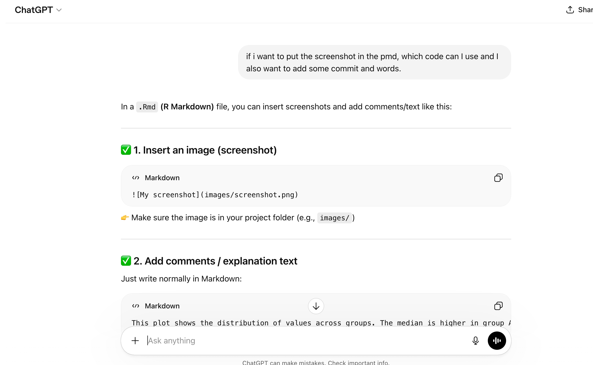
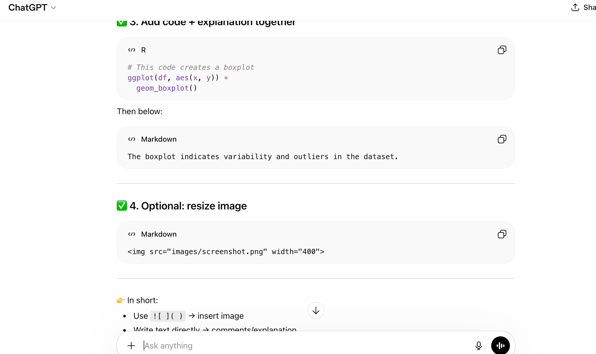

# AI announcement
In my assignment1

I used ChatGPT as my support tool to help me understand some functions and grammar that I didn’t know. The AI provided some code examples to help me understand the functions that I hadn’t learned.
I used AI to:
Show me how to use the functions that I want to code with my assignment.
provide some example to read all csv data in one folder.
explain some functions grammar and check the correctness of my code.
The completion of this assignment and the code writing were all done by myself. I only used the AI to tell me how to understand the function packages and the grammar logic of the functions, and pointed out the problems in the code that I wrote.


## Screenshots

```{r}
#| echo: false

```


```{r}

```


```{r}

```


```{r}

```


```{r}

```


```{r}

```


```{r}

```


```{r}

```